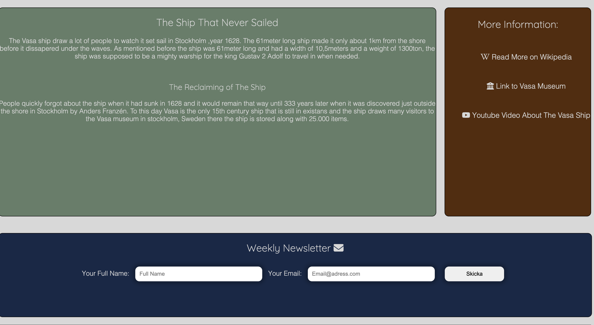

# Vasa Skeppet

## This is my first project done for code institute. Its an simple website for people intersted in the history of the Vasa ship.

The main goal with the website is to create a melting pot for people who are interested in the history of the Vasa ship and want to follow all the new reaserch that is made related to the Vasa Ship. As described the website is simble in its nature and should be seen as the site to sign up for and follow if you are on the hunt for new information about the Vasa ship.

## features

### Navigation
- provides link to different sections in the page, home, sign up etc 
- Have the main heading for the page in the upper left corner
- the navigation respons to different screen sizes 

### Header
- hero image that displays the Vasa ship
- gives the user option to scroll down to watch the ship or press jump links to sections

### Interesting Facts/More Information
- This part of the page gives some nuggets of facts to spark interest about the Vasa ship
- The more information part is so that interested readers can look up some more about the Vasa ship in an easy way

### Sign Up Form
- The sign up form is so that the user can subscribe to the weekly newsletter that gives out facts/happening around and aboout the vasa ship
- The form demands that the user put in a full name and an valid email adress

### The Google map
- The map section was important to the page because it brings a conection to the Vasa museum and creates a bridge to something real
- The map is used through Google map and it shows where to find the Vasa museum in Stockholm, Sweden

problems on the way, positioning, the hyperlinks to work properly
problem with the anchor to link to the headings

## Testing of The Website
- the website is validated through:
 - W3C validation (HTML)
 - Jigsaw validation (CSS)
 - accessibility (Lighthouse)

 

## Color Palette
-Got the palette from [This website](https://colorhunt.co/palette/182747562b08647e68d8d8d8)

## Bugs
 - had problem with the css not loading correctly when uploading the website
 - early bug that made the jump links in the navigation un clickable
### Solved bug 
- solved the bug through the changing of the source (assets/css/style.css) instad of (/assets/css/style.css)
- The hero image div was layered over the jump links in the navigation, changed that so that the links works

## Deployment 
The site was deployd through Github pages 
- [Link to the site ](https://albinhall.github.io/Vasaskeppet/?full_name=hej+hel&email=albin%40hej.se#home)

## Credit content
- The facts about the Vasa Ship was taken from So-Rummet
 - [The link to So-rummet](https://www.so-rummet.se/fakta-artiklar/vasaskeppet-skrytbygget-som-blev-ett-fiasko#)

### Pictures
The picture was taken from the Vasa museum website 
 - [Vasa museum website](https://www.vasamuseet.se/om-vasamuseet/pressrum/genrebilder)